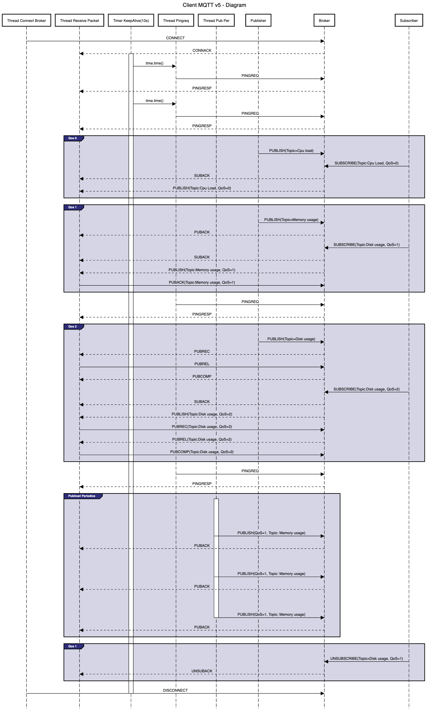
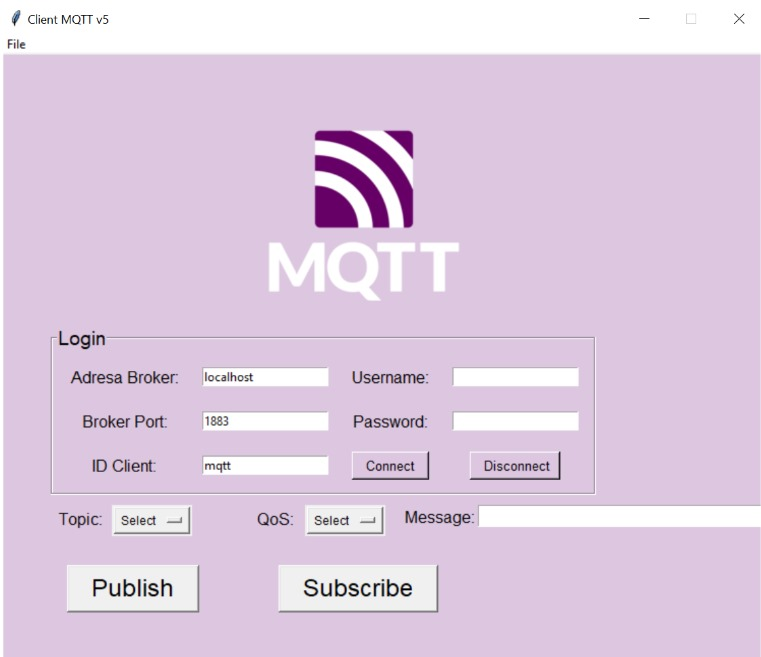
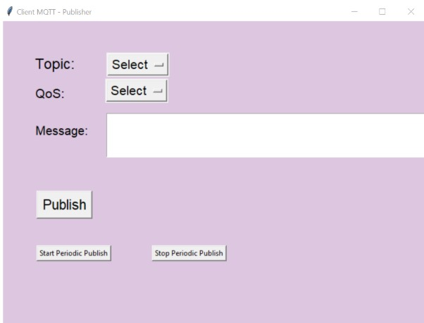
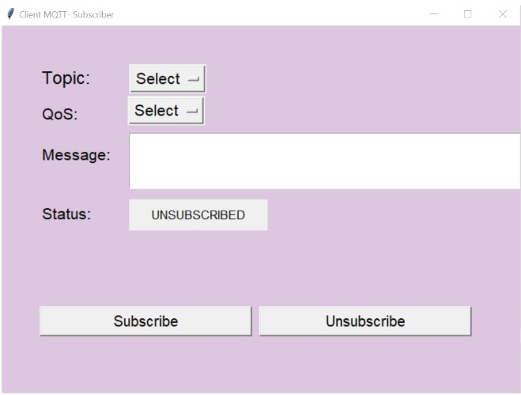

# MQTT Client MQTT v5

## Introducere
MQTT v5 (Message Queuing Telemetry Transport) este un protocol de transport al mesajelor bazat pe TCP/IP, utilizat pentru comunicarea între clienți și brokeri într-o arhitectură publicare/abonare. Acesta este utilizat pe scară largă în aplicațiile IoT, datorită eficienței și fiabilității sale în comunicarea între dispozitivele cu resurse limitate. În acest proiect, am implementat un client MQTT v5 care se conectează la un broker, publică mesaje pe topicuri și se abonează la topicuri pentru a primi mesaje.

## Structura Pachetelor
Clientul MQTT v5 utilizează mai multe tipuri de pachete pentru a gestiona comunicarea cu brokerul:

- **Fixed Header**: Include tipul pachetului (de exemplu, CONNECT, PUBLISH, SUBSCRIBE) și dimensiunea restului pachetului.
- **Variable Header**: Secțiune opțională ce depinde de tipul pachetului (exemplu: pentru CONNECT include versiunea protocolului și parametrii de autentificare).
- **Payload**: Conține datele efective transmise (mesaje aplicație, informații de conectare).

## Mecanisme Implementate

### a. **CONNECT și CONNACK**
- Configurarea brokerului (ex. Mosquitto).
- Configurarea ID-ului clientului.
- Configurarea mesajului Last Will.
- Autentificare cu utilizator și parolă.

### b. **PUBLISH și PUBACK**
- Publicarea mesajelor către broker și livrarea lor către clienții abonați.

### c. **SUBSCRIBE și SUBACK**
- Abonarea la un topic și confirmarea acestuia de către broker.

### d. **UNSUBSCRIBE și SUBACK**
- Dezabonarea de la un topic.

### e. **Deconectare și Last Will**
- Trimiterea unui pachet DISCONNECT pentru deconectarea corectă de la broker și tratarea mesajului Last Will.

### f. **Mecanismul QoS**
-  **QoS 0**: Livrare cel mult o dată.
-  **QoS 1**: Livrare cel puțin o dată.
-  **QoS 2**: Livrare exact o dată.

### g. **Keep Alive**
- Mecanismul de menținere a conexiunii activă între client și broker prin trimiterea periodică a pachetelor PINGREQ și răspunsurilor PINGRESP.

## Tehnologii Folosite
- **Socket**: Pentru gestionarea conexiunii și a pachetelor MQTT.
- **Mosquitto Broker**: Broker MQTT folosit pentru gestionarea mesajelor.

## Diagrama Client MQTT v5

Această diagramă ilustrează fluxul de mesaje într-un client MQTT v5, evidențiind interacțiunile dintre principalele componente: brokerul MQTT, publisher-ul și subscriber-ul.

## Interfața Clientului MQTT

Clientul MQTT dispune de o interfață în care utilizatorul introduce date esențiale pentru conectarea la broker.

După completarea corectă a datelor și trimiterea pachetului CONNECT, brokerul Mosquitto procesează cererea și răspunde cu un mesaj CONNACK în cazul unei conectări reușite.

Odată ce conexiunea este stabilită, utilizatorul poate selecta unul dintre cele două roluri principale ale clientului:
1. **Publisher**:
   - Acest rol permite utilizatorului să publice mesaje pe diferite topicuri. Utilizatorul poate alege să publice informații periodice sau să răspundă la evenimente, cum ar fi monitorizarea parametrelor de sistem (utilizare CPU, memorie, etc.).
   - Mesajele sunt publicate cu diferite QoS-uri pentru a asigura livrarea corectă a acestora.

2. **Subscriber**:
   - Rolul de abonat permite utilizatorului să se aboneze la topicuri și să primească mesaje trimise de alți publicatori.
   - Abonatul poate alege topicuri specifice la care dorește să primească actualizări și poate solicita un nivel de QoS pentru a controla fiabilitatea livrării mesajelor.

Toate pachetele trimise și primite de clientul MQTT pot fi vizualizate în Wireshark, oferind o modalitate ușoară de a verifica comunicațiile între client și broker.
